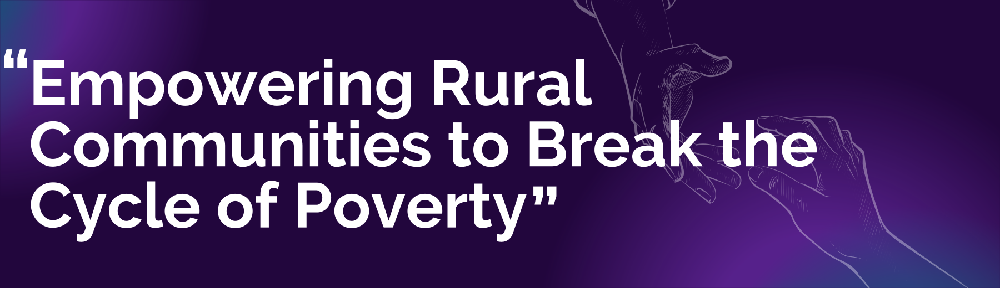

<div align="center">
  <br />
    <a href="/" target="_blank">
      
    </a>
  <br />
</div>

## Table of Contents
1. [💡 Introduction](#-introduction)
2. [🎯 Our Target SDG Goals](#our-target-sdg-goals-)
3. [ℹ️ About the Project](#about-the-project-ℹ️)
4. [🎯 Our Mission](#our-mission)
5. [🌍 Why This Matters](#why-this-matters)
6. [📝 What We Do](#what-we-do-)
7. [⚙️ Tech Stack](#tech-stack-⚙️)
8. [🤝 Join Us](#join-us-🤝)
9. [🌐 Social Media](#🌐-social-media)
10. [🚀 Future Development](#🚀-future-development)
11. [📖 About Us](#about-us)
12. [🛠️ Setup](#setup-🛠️)


# 💡 Introduction

In a world abundant with resources yet marked by unequal distribution, countless individuals continue to face hunger and poverty. At the same time, rising food and clothing waste contributes to environmental damage and represents missed opportunities to support those in need. This imbalance is what inspired us to create Wall of Humanity—a platform committed to connecting donors with underserved communities, promoting sustainability and compassion.

Wall of Humanity is more than just a platform; it’s a movement aimed at breaking the cycle of poverty, particularly in rural areas. By redistributing surplus food, clothing, and essential goods, we strive to offer immediate relief while fostering long-term empowerment. Our platform bridges the gap between those who have resources to share and those in need, ensuring that no valuable resource goes to waste.


### Our Target SDG Goals 🎯
<div style="display: flex; justify-content: space-between; align-items: center; ">
  
  
</div>


Our goal is to reduce food waste by redistributing surplus resources and providing essential items to those in need, fostering a more sustainable and equitable community.

## About the Project ℹ️
**Welcome to **Wall of Humanity**! Our platform is designed to tackle two major issues:** food and poverty. We believe in the power of community and sustainability, so we've created a space where people can donate items they no longer need, like clothes and food, to help those who truly need them. By connecting donors, social workers, and NGOs, we ensure that these items find their way to the people who need them most. People can join us as the volunteer to help us.

### Our Mission
At **Wall of Humanity**, our mission is simple: reduce waste and empower communities. We’re here to help break the cycle of poverty by redistributing surplus resources to those in need, especially in rural areas. Together, we can build a more sustainable and compassionate world. Our project reduces the wastage of and resources.

### Why This Matters
<br/>

- **Food Waste Crisis**: According to the Food and Agriculture Organization (FAO), approximately one-third of all food produced globally is wasted, while millions go hungry every day.
- **Clothing Waste**: The fashion industry contributes significantly to landfill waste, yet many individuals struggle to access basic clothing.
- **Rural Poverty**: Rural communities often lack access to resources, leaving them trapped in cycles of poverty and limited opportunities.

## How We Make a Difference
- **Connecting Donors and Recipients**: Our platform allows individuals and organizations to donate surplus items, which we collect and distribute to those in need with the help of NGOs and volunteers.
- **Empowering Communities**: By addressing immediate needs like food and clothing, we help underprivileged individuals redirect their resources towards building better futures.
Promoting Sustainability: By reducing waste and giving items a second life, we contribute to a healthier planet for future generations.


## What We Do 📝

### How Donations Work
- **Donors**: If you have clothes, food, or other essentials that you no longer need, you simply can sign up and list them on our platform to donate. We’ll take care of the rest!
- **Collection & Distribution**: Once donations are made, our team works to collect and distribute these items to people or the NGO who can reach to needy people.

### Sustainability at the Core
We’re all about reducing waste and giving items a second life. By reusing goods, we not only help those in need but also contribute to a more sustainable future.

### Impact on Communities 🌍
Our project isn’t just about giving away things — it’s about changing lives. By providing basic necessities food and clothes to rural communities, we help people focus on what really matters: education, healthcare, and long-term empowerment. If someone orders food instead of buying it from outside they can invest their money in education.

**A Google Solution Challenge Project 2025**  
**Organized by:** Google Developer Group On Campus  

**Project by:**  
**Team V_VAS Coders**  
From **Dr. D. Y. Patil Pratishthan's College of Engineering**,  
Salokhenagar, Kolhapur, Maharashtra, India.


## Problem Statement 🌍.



**Problem Statement**: Empowering Rural Communities to Break the Cycle of Poverty.

**Solution**: Our platform, **Wall of Humanity**, aims to reduce food and clothing waste by connecting donors with those in need. Donors can donate items through our platform, which we collect and distribute with the assistance of NGOs to ensure they reach the right beneficiaries.

The **Wall of Humanity** solves the problem of food and clothing waste by creating a space where people can donate their surplus items. With the help of NGOs and volunteers, we ensure that these donations are collected and distributed to those who need them the most. It’s all about making sure that no good resource goes to waste, and that everyone has access to what they need to thrive.


## Who’s It For?

- **Donors**: People who want to make a difference by donating food, clothes, or other items they no longer need.
- **Team Members**: Volunteers or staff who help with collecting and distributing donations.
- **NGOs**: Organizations that assist in the distribution process, ensuring that the donations reach the right people.

## Our Impact

### Social Impact
By offering food, clothes, and other essentials to those who need them most, we’re helping people focus on what truly matters — building a better future. Our goal is to create a ripple of positive change in rural communities, helping individuals break free from the grip of poverty and improve their lives for the long term.

### Environmental Impact
We’re also passionate about sustainability. By reusing goods that would otherwise go to waste, we help reduce environmental harm caused by overproduction and waste disposal.

## Tech Stack ⚙️ 

We’ve built this platform using modern tools to make it easy to use and maintain:

- **Frontend**: React, Tailwind CSS.
- **Backend**: Node.js, Express (we’re using these technologies to build a fast and responsive system).
- **Database**: MongoDB.
- **Google Tools**:
  - **Google Maps API**: For displaying locations of donors and recipients, calculating distances, and providing geolocation services.
  - **Google Cloud Platform (GCP)**: For hosting the application, using cloud functions, and securely storing data. Services like **Firebase** (for authentication and real-time databases), **Google Cloud Storage** (for file storage), and **Google Cloud Functions** (for serverless computing) are utilized.
  - **Google Places API**: To help users find nearby places, like donation centers or food distribution points.
  - **Google Analytics**: For tracking user behavior and optimizing platform performance.

### Join Us 🤝  

At **Wall of Humanity**, we believe in the power of community and collective action to make a difference. Whether you’re an individual, an organization, or just someone looking to give back, there’s a place for you in our mission to reduce waste and empower communities.  

#### How You Can Join  

1. **As a Donor**  
   - Got clothes, food, or other essentials you no longer need? Sign up on our platform to donate.  
   - Your contributions will go directly to those in need through our team and NGO partners.  

2. **As a Volunteer**  
   - Help us collect, organize, and distribute donations.  
   - Work alongside our team to ensure the right resources reach the right people.  

3. **As a Partner NGO**  
   - Collaborate with us to distribute donations efficiently.  
c   - Together, we can maximize our impact and reach more communities in need.  

#### Why Join Us?  

- **Make a Difference**: Every small act of kindness contributes to a larger impact.  
- **Support Sustainability**: Help reduce waste and give resources a second life.  
- **Empower Communities**: Be part of a movement that’s breaking the cycle of poverty.  

### 🌐 Social Media
<p>Stay connected and join our mission to empower communities and reduce waste. Follow us on:</p>

## Follow Us

[](https://www.instagram.com/wall.of.humanity)
[](https://www.linkedin.com/in/yourprofile)
[](https://discord.gg/WzJqAbYjWv)
[](https://x.com/V_VasCoders?t=vF8YDYUsFYOSPLhGQjwgDg&s=09)


By following us on social media, you can:  
- Get inspired by the impact we’re making together.  
- Learn about upcoming donation drives and events.  
- Share our mission with your friends and family.  

Let’s spread kindness, one click at a time! 💕

## 🚀 Future Development

- As part of our ongoing efforts to recognize and reward the valuable contributions of our volunteers, we plan to introduce **Certificates of Appreciation** for their time, effort, and dedication to the cause.
- Along with the **Certificates of Appreciation**, we will also distribute **Food Coupons** for popular food and clothing brands like **Swiggy**, **Zomato**, **Amazon**, **Flipkart**, **Myntra**, **Dominos**, and more to people in need of food. These coupons will provide practical assistance to help them access meals and clothing, supporting their basic needs.
- This initiative will not only recognize the volunteers' efforts but also directly benefit those who are hungry or in need of clothing, helping us achieve our mission of supporting communities in need.
- We’re excited to roll out this program soon, and we’re grateful to all those who contribute to making a positive impact.
- Additionally, we aim to introduce a **Scholarship Program** to support underprivileged children in completing their education. This initiative will provide financial assistance to deserving students, helping them pursue their academic goals and break the cycle of poverty.

## About Us
<div align="center">

|  |  |  |  |
|:--------------------------------------------------------:|:---------------------------------------------------------:|:-------------------------------------------------------:|:--------------------------------------------------------:|
| **Vansh Kirtishahi**<br>Founder of Wall of Humanity, working on managing operations and ensuring smooth project execution. | **Shreyash Rakhunde**<br>Social Worker, coordinating with NGOs to ensure donations reach those in need. | **Adinath Jadhav**<br>Software Engineer, leading the tech side of the project and ensuring smooth integration. | **New Person's Name**<br>Role description of the new person. |

</div>

## Setup 🛠️ 

### Setting Up the Project Locally
Want to contribute to the project or run it on your local machine? Here’s how you can get started:

1. Clone the repository:
   ```bash
   git clone https://github.com/yourusername/wall-of-humanity.git  
2. Navigate to the project directory:
    ```bash
    cd wall-of-humanity
3. Install dependencies:
    ```bash
    npm install
4. Start the development Server:
    ```bash  
    npm run dev 
